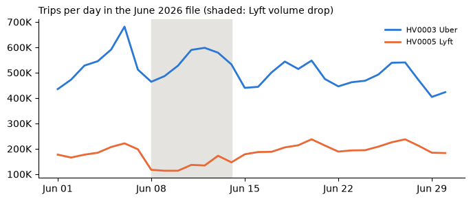
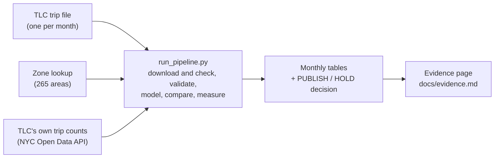

#  NYC Rider Wait Pipeline


[](https://www.nyc.gov/site/tlc/about/tlc-trip-record-data.page)
[](https://data.cityofnewyork.us/)

**How long do New Yorkers wait for an Uber or Lyft, and can this month's number be trusted?** Every month, this pipeline answers both questions from the city's public trip records.

FDE Data Foundations assignment, Track B (NYC TLC).

| | |
|---|---|
| **Problem** | Riders say app-based cars take too long to arrive, especially outside Manhattan. The city gets about 21 million trip records a month but has no trusted monthly view of waiting. |
| **Who uses it** | The NYC Taxi and Limousine Commission (TLC) policy team, who raise service problems with Uber and Lyft. |
| **KPI** | **Long-wait rate:** the share of trips where the rider waited more than 10 minutes between requesting the ride and being picked up. |
| **Decision it supports** | Which boroughs and neighbourhoods to raise with Uber and Lyft this month, and whether this month's numbers are safe to quote. |

##  Results

| Month | Long-wait rate | Can it be published? |
|---|---|---|
| May 2026 | 9.7% | ✅ **PUBLISH**: every check passed |
| June 2026 | 12.0% (could be 11.8% to 14.0%) | ⛔ **HOLD**: the file is missing about 455,000 trips |
| July 2026 | 10.0% | ⚠️ **PUBLISH WITH CAVEATS**: one TLC report is not out yet |


- **Staten Island** has the longest waits every month (16% to 17%), then **the Bronx and Queens** (12% to 14%). Manhattan has the shortest.
- Riders who ask for a **wheelchair-accessible** car wait over 10 minutes almost 3 times as often.
- Most of the wait is the **driver getting to the rider**, so driver supply nearby is what matters.

All numbers and the top zones: [docs/evidence.md](docs/evidence.md).

## The key judgement call: holding June

June's file downloaded perfectly, but TLC's own published count says it should hold about 455,000 more trips (2%). The most likely cause is a week of Lyft trips missing from the file (June 8 to 14):



Publishing would quietly rest on missing data, and filling the gap would mean making data up. So the pipeline marks June **HOLD**, by a rule set before any month was checked, shows the range the rate could really be, and asks TLC to republish. Full reasoning: [decision D6](docs/decisions.md#d6-june-2026-is-on-hold-the-file-is-21-short-of-tlcs-own-count).

## How it works



- **Every download is checked** (size, fingerprint, row count), and then compared with TLC's own counts.
- **Bad trips are flagged, never deleted**, and left out only of the numbers they would distort.
- **Safe to rerun:** the same month gives the same output, and a failure never overwrites good results.

## Data sources

| Source | How it is fetched | What it gives |
|---|---|---|
| TLC trip records, one Parquet file a month | File download | Every Uber and Lyft trip: request, pickup and dropoff times, pickup zone |
| TLC taxi zone lookup (CSV) | File download | Which borough each zone is in |
| TLC published trip counts (NYC Open Data) | REST API | An independent total to prove the file is complete |

More: [source map](docs/source_map.md) and [data model](docs/data_model.md).

## Run it

Needs Python 3.11+ and about 2 GB of disk.

```bash
python -m venv .venv
.venv/Scripts/activate            # macOS/Linux: source .venv/bin/activate
pip install -r requirements.txt

python run_pipeline.py --from 2026-05 --to 2026-07   # run three months
pytest                                               # 24 offline tests
```

## What it produces

| Output | Where |
|---|---|
| Metric tables for each month (citywide, borough, zone, wheelchair-accessible) | `outputs/month=YYYY-MM/metrics_*.csv` |
| Validation and completeness reports | `validation_report.json`, `reconciliation.json` in the same folder |
| The publish decision and a record of the run | `run_manifest.json` |
| The final evidence table and chart | [docs/evidence.md](docs/evidence.md) |

## Known / Unknown / Assumptions / Limitations

| | |
|---|---|
| **Known** | About 1 ride in 10 waits over 10 minutes. Staten Island is worst, then the Bronx and Queens. May and July match TLC's counts to within 0.01%. |
| **Unknown** | Why June is short and whether TLC will republish it. How many riders gave up waiting. Why waits are long. |
| **Assumptions** | "Long" means over 10 minutes (5 and 15 are shown too). The June HOLD limit (2%) was set in advance. Stakeholders are assumed, not interviewed. |
| **Limitations** | Only completed trips are published, so this is a floor on rider pain. Locations are zones, not addresses. The data shows where waits are long, not why. |

## More detail

- [docs/details.md](docs/details.md): class skill map, stakeholders, every run option, failure scenarios, the full Known / Unknown list
- [docs/validation_rules.md](docs/validation_rules.md), [docs/metrics.md](docs/metrics.md), [docs/decisions.md](docs/decisions.md)
- [notebooks/](notebooks/01_profile_validate_model.ipynb): the profiling notebook behind every rule
- [Python Notebook Challenges/](Python%20Notebook%20Challenges): the solved Class 5 to 7 notebooks

<sub>Icons: [Twemoji](https://github.com/jdecked/twemoji), CC-BY 4.0. Badges: [shields.io](https://shields.io).</sub>
