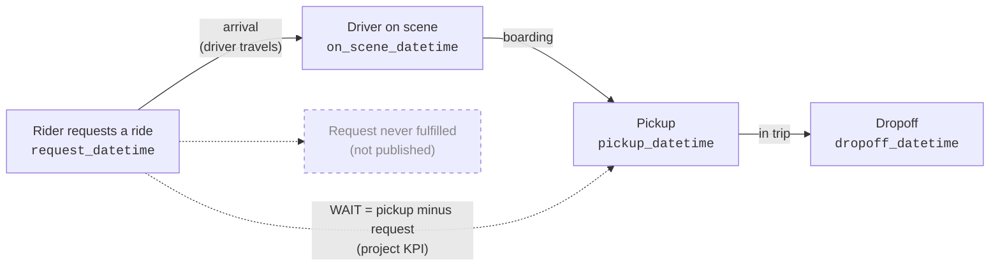
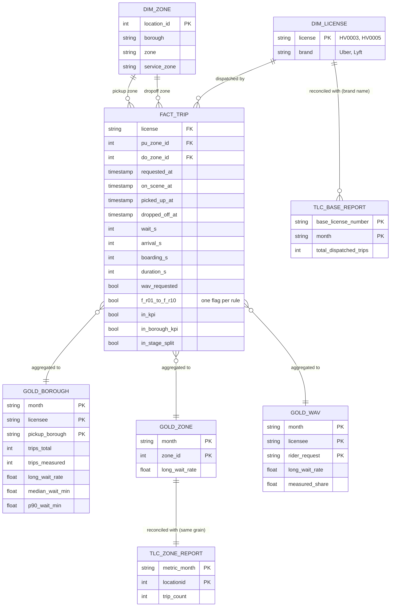
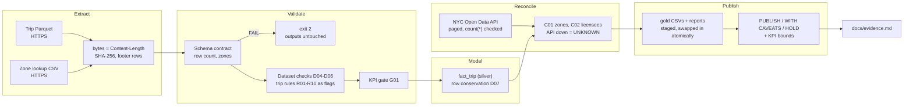

# Workflow and data model

Raw sources are organised by how TLC publishes them. The model reorganises them around the rider's workflow, so every metric is a question about a stage of that workflow.

## 1. The rider workflow (business process)

| Stage | Measured as | Recorded by | Trust |
|---|---|---|---|
| Wait (KPI) | `pickup_datetime - request_datetime` | Both licensees, same meaning | Good; 1.2% negative (likely scheduled rides), quarantined |
| Arrival | `on_scene_datetime - request_datetime` | Both, but inconsistently | Descriptive only (see source map Q3) |
| Boarding | `pickup_datetime - on_scene_datetime` | Both, but inconsistently | Descriptive only |
| In trip | `dropoff_datetime - pickup_datetime` | Both | Good; `trip_time` disagrees for Lyft, so timestamps are used |
| Unfulfilled request | none | Not published | **Missing event**: the KPI can only describe riders who were picked up |

**Entities:**
- **Trip:** the unit of the KPI.
- **Taxi zone:** where the trip starts and ends, rolled up to borough.
- **Licensee:** the HV company.

**Events:** request, on scene, pickup, dropoff. Each is a timestamp on the trip row; the source has no separate event log.

**States:** a trip in the file is always in its final state (completed). Waiting, cancelled and unmatched are states the rider passes through, but the source never records them.

**Interventions:** none exist in this data. Compare FlashEats, where reassignments and restaurant contacts were recorded. The closest thing to a rider-side intervention is asking for a WAV or a shared ride (`wav_request_flag`, `shared_request_flag`).

## 2. Relational model

Grain per table:

| Table | Layer | Grain | Rows (June 2026) |
|---|---|---|---|
| raw trip file | bronze | one published trip record | 20,775,868 |
| `fact_trip` | silver | one trip, nothing dropped, every flag attached | 20,775,868 |
| `metrics_borough.csv` | gold | month x licensee (incl. All) x pickup borough (incl. Citywide) | 21 |
| `metrics_wav.csv` | gold | month x licensee x WAV requested | 6 |
| `metrics_zone.csv` | gold | month x pickup zone (known zones with trips) | 260 |
| `reconciliation_zone.csv` | gold | month x zone, file count vs TLC count (full outer join) | 261 |

The trip file has no trip ID. A duplicate is therefore defined as a row identical in every column (check D04: zero in all three months).

**Aggregate before joining (Class 7):** the file and TLC's report are each reduced to one row per zone before the join. Joining 20M trips to the report row by row would repeat each zone's published count on every trip.

## 3. Pipeline flow

