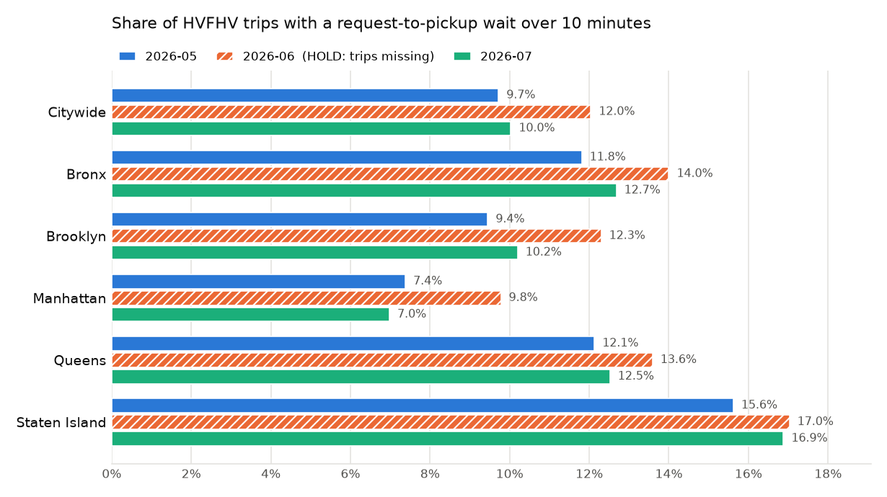

# Evidence: NYC HVFHV rider wait times

Generated by `pipeline/report.py` from the committed outputs in `outputs/month=*/`. Do not edit by hand; rerun the pipeline instead. Metric definitions: [metrics.md](metrics.md). Validation rules: [validation_rules.md](validation_rules.md).

## 1. Can each month be published?

| Month | Decision | Trips in file | vs TLC zone report | vs TLC base report | Usable for KPI | KPI range if missing trips counted |
|---|---|---|---|---|---|---|
| 2026-05 | **PUBLISH** | 22,125,744 | PASS (+0.01%) | PASS | 98.7% | not needed |
| 2026-06 | **HOLD** | 20,775,868 | FAIL (-2.15%) | UNKNOWN | 98.7% | 11.8% to 14.0% |
| 2026-07 | **PUBLISH WITH CAVEATS** | 20,921,249 | PASS (+0.01%) | UNKNOWN | 98.8% | not needed |

PUBLISH: every deciding check passed. PUBLISH WITH CAVEATS: a check is WARN or UNKNOWN (usually a TLC report not yet released). HOLD: the file disagrees with TLC's own published counts beyond the agreed tolerance; the numbers exist for investigation but should not be quoted as the month's result.

## 2. Final evidence table (citywide)

| Metric | 2026-05 | 2026-06 | 2026-07 |
|---|---|---|---|
| M1 Long-wait rate (> 10 min), citywide | 9.7% | 12.0% | 10.0% |
| M1 sensitivity: > 5 min / > 15 min | 42.6% / 2.6% | 46.7% / 3.6% | 42.5% / 2.7% |
| M1 by licensee: Uber / Lyft | 11.1% / 6.5% | 13.6% / 7.7% | 11.4% / 6.5% |
| M2 Median / P90 wait (min) | 4.48 / 9.90 | 4.77 / 10.75 | 4.45 / 10.02 |
| M3 Median driver arrival / boarding (min) | 3.50 / 0.68 | 3.78 / 0.65 | 3.43 / 0.68 |
| M4 Long-wait rate: WAV requested / standard | 27.2% / 9.7% | 32.0% / 12.0% | 28.3% / 10.0% |
| M4 WAV trips whose wait is unmeasurable | 24.6% | 19.6% | 21.5% |
| M5 Trips usable for the KPI | 98.7% | 98.7% | 98.8% |
| M5 File vs TLC published pickups | +0.01% | -2.15% | +0.01% |

## 3. Project KPI by pickup borough

| Pickup borough | 2026-05 | 2026-06 | 2026-07 |
|---|---|---|---|
| Bronx | 11.8% (P90 10.6 min) | 14.0% (P90 11.4 min) | 12.7% (P90 10.9 min) |
| Brooklyn | 9.4% (P90 9.8 min) | 12.3% (P90 10.8 min) | 10.2% (P90 10.1 min) |
| Manhattan | 7.4% (P90 9.0 min) | 9.8% (P90 9.9 min) | 7.0% (P90 8.8 min) |
| Queens | 12.1% (P90 10.8 min) | 13.6% (P90 11.3 min) | 12.5% (P90 10.9 min) |
| Staten Island | 15.6% (P90 11.9 min) | 17.0% (P90 12.4 min) | 16.9% (P90 12.4 min) |

## 4. Zones with the highest long-wait rate in every month (at least 5,000 measured trips)

These are the candidates to raise in licensee reviews. Airport zones need their own reading: riders walk to a designated pickup area, so part of the wait is not driver supply.

| Zone | Borough | 2026-05 | 2026-06 | 2026-07 |
|---|---|---|---|---|
| City Island | Bronx | 41.2% | 42.1% | 42.8% |
| Flushing Meadows-Corona Park | Queens | 26.8% | 34.7% | 30.6% |
| Hammels/Arverne | Queens | 27.9% | 31.0% | 30.1% |
| Far Rockaway | Queens | 24.1% | 27.3% | 27.2% |
| Rockaway Park | Queens | 24.8% | 26.3% | 25.9% |
| JFK Airport | Queens | 25.8% | 25.1% | 23.9% |
| LaGuardia Airport | Queens | 24.5% | 25.1% | 24.0% |
| Charleston/Tottenville | Staten Island | 22.7% | 25.0% | 23.5% |
| Pelham Bay Park | Bronx | 18.9% | 25.5% | 24.2% |
| Douglaston | Queens | 20.4% | 22.9% | 22.1% |

## 5. Run provenance

| Month | Run id | Git commit | Config | Trip file SHA-256 |
|---|---|---|---|---|
| 2026-05 | `20260924T211259Z-085178` | `1a4c121` | `712d286d680d` | `e2b633a5be2280da...` |
| 2026-06 | `20260924T211516Z-eacffe` | `1a4c121` | `712d286d680d` | `300f8dccfae90253...` |
| 2026-07 | `20260924T211259Z-085178` | `1a4c121` | `712d286d680d` | `8da280d9d23813aa...` |

Latest month in this report: 2026-07.
